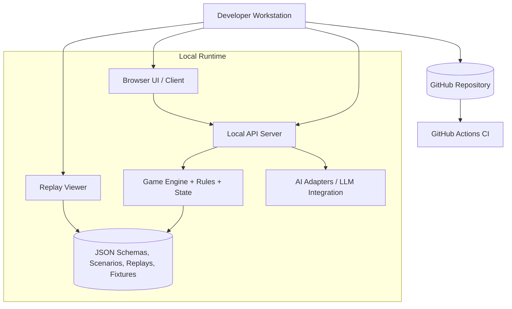
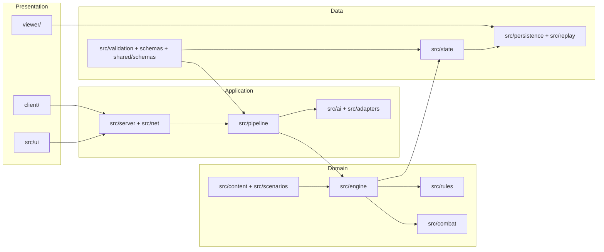
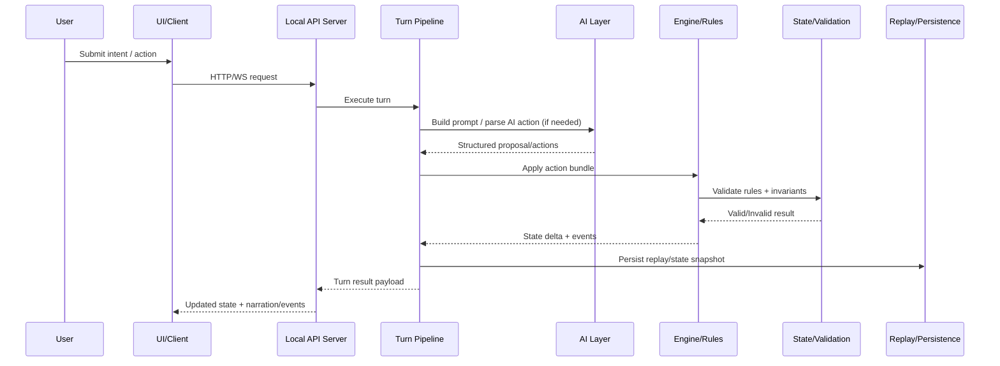
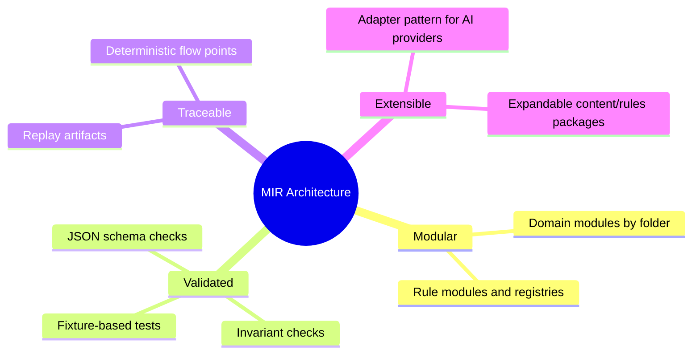

# MIR Infrastructure, Architecture, and Components

This document explains the system at three levels:

1. **Infrastructure** (where and how services run)
2. **Architecture** (how major subsystems connect)
3. **Components** (what each module is responsible for)

---

## 1) Infrastructure Overview

### Description
- Development happens locally and is synced through GitHub.
- CI validates quality gates (tests, schema checks, fixtures).
- Runtime is modular: UI/Viewer interact with server and engine; data artifacts are persisted as JSON schemas, scenarios, and replay files.

---

## 2) High-Level Architecture

### Description
- **Presentation** handles interaction, rendering, and replay visualization.
- **Application** orchestrates requests and turn execution.
- **Domain** encapsulates game rules, actions, combat logic, and content generation.
- **Data** governs state integrity, persistence, and schema validation.

---

## 3) Request-to-Result Flow

### Description
- The pipeline is the coordination layer for turn execution.
- AI output is treated as structured input and validated before state mutation.
- Replay persistence gives traceability for debugging and deterministic review.

---

## 4) Component Map (by Directory)

```mermaid
flowchart TB
    Root[Project Root]

    Root --> Core[src/core]
    Root --> Config[src/config]
    Root --> AI[src/ai]
    Root --> Adapters[src/adapters]
    Root --> Engine[src/engine]
    Root --> State[src/state]
    Root --> Rules[src/rules]
    Root --> Pipeline[src/pipeline]
    Root --> Net[src/net]
    Root --> Server[src/server]
    Root --> Content[src/content]
    Root --> Scenarios[src/scenarios]
    Root --> Replay[src/replay]
    Root --> Persistence[src/persistence]
    Root --> UI[src/ui]
    Root --> Validation[src/validation]
    Root --> Tests[tests]
    Root --> Scripts[scripts]
    Root --> Schemas[schemas + shared/schemas]

    Core --> CoreDesc[Logging, assertions, env/bootstrap helpers]
    AI --> AIDesc[Intent parsing, prompting, memory/model integration]
    Engine --> EngDesc[Combat, movement, initiative, difficulty, effects]
    State --> StateDesc[State shape, bootstrap, invariants, validation]
    Rules --> RulesDesc[Rule modules and registry]
    Pipeline --> PipeDesc[Proposal-to-actions and turn orchestration]
    Net --> NetDesc[Event broadcast and networking surfaces]
    Content --> ContentDesc[Encounters, map editor, community registry, generators]
    Replay --> ReplayDesc[Run/hash replay and trace flow]
    UI --> UIDesc[Renderer/controllers/browser adapters]
    Validation --> ValDesc[Schema + contract enforcement]
```

---

## 5) Core Component Responsibilities

| Component | Responsibility | Key Inputs | Key Outputs |
|---|---|---|---|
| `src/ui`, `client`, `viewer` | User-facing rendering and interaction | User intent, server events, replay files | Requests, visual state, controls |
| `src/server`, `src/net` | API entry points and event transport | UI/client requests | Turn results, streamed events |
| `src/pipeline` | Orchestrates turn lifecycle | Intent/proposal, current state | Action bundle execution result |
| `src/ai`, `src/adapters` | AI prompt/parse/model integration | Game context, intent | Structured proposals/actions |
| `src/engine`, `src/combat` | Applies domain rules and mechanics | Validated actions + state | State delta, combat/events/narration hooks |
| `src/rules` | Modular rule definitions/registry | Engine context | Rule constraints/behavior |
| `src/state` | Canonical state management | Action effects, bootstrap data | Validated next state |
| `src/validation`, `schemas` | Schema + invariant enforcement | State/actions/responses | Pass/fail diagnostics |
| `src/replay`, `src/persistence` | Replay/session/campaign persistence | State transitions, events | Stored traces and restorable snapshots |
| `src/content`, `src/scenarios` | Game content and generation utilities | Templates/config/rules | Encounters, maps, scenarios |

---

## 6) Architectural Characteristics

### Summary
The codebase is organized around a **validated turn pipeline** with clear module boundaries: presentation, orchestration, domain logic, and data integrity. This supports safe iteration, AI-assisted gameplay, and replay-driven debugging.
